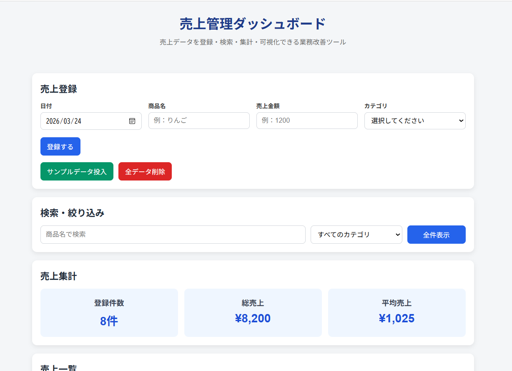

# 売上管理ダッシュボード

売上データを「登録・検索・集計・可視化」できる、業務改善を意識した売上管理ツールです。
未経験からIT事務・フロント寄りコーダーへの転職を目指し、実務での利用を想定して制作しました。

---

## 🌐 URL

* GitHub Pages: （公開後に記載）
* GitHub Repository: （リポジトリURLを記載）

---

## 📌 概要

売上データを入力・管理するだけでなく、
検索・絞り込み・集計・グラフ表示まで一貫して行えるアプリです。

事務職で扱うことの多い「データ入力・一覧管理・集計業務」を再現し、
業務効率化ツールとしての実用性を意識しています。

---

## 🎯 作成背景

現職の人事総務業務では、Excelを用いたデータ管理や集計作業を行っています。

その経験から、
「入力 → 管理 → 集計 → 可視化」までを一つのツールで完結できる仕組みを作りたいと考え、本アプリを制作しました。

実務での使いやすさを意識し、
シンプルなUIと直感的な操作性を重視しています。

---

## 🛠 主な機能

### ■ 売上管理

* 売上データの登録（日時・商品名・金額・カテゴリ）
* 売上一覧表示
* データ削除（確認ダイアログ付き）

### ■ 検索・絞り込み

* 商品名によるリアルタイム検索
* カテゴリによる絞り込み
* 全件表示リセット

### ■ 集計機能

* 登録件数
* 総売上
* 平均売上

### ■ データ可視化

* 日別売上（折れ線グラフ）
* カテゴリ別売上（棒グラフ）

### ■ ユーザビリティ向上

* localStorageによるデータ保存
* 今日の日付の自動入力
* 登録メッセージ表示
* データがない場合の表示対応
* サンプルデータ投入機能
* 全データ削除機能

---

## 💻 使用技術

* HTML
* CSS
* JavaScript（Vanilla）
* Chart.js
* localStorage

---

## 💡 工夫した点

### ■ 実務を意識した設計

入力・検索・集計・可視化を1画面にまとめ、
業務での「確認のしやすさ」と「操作効率」を重視しました。

### ■ 検索性の向上

商品名検索はリアルタイムで反映し、
カテゴリフィルターと組み合わせて目的のデータを素早く抽出できるようにしました。

### ■ 視覚的なデータ把握

数値だけでなくグラフで表示することで、
売上の傾向を直感的に把握できるようにしました。

### ■ 初見ユーザーへの配慮

サンプルデータ投入機能を実装し、
初めて触るユーザーでもすぐに動作確認できるようにしました。

---

## 🔧 今後の改善案

* 編集機能の追加
* 月別・期間別の集計機能
* 並び替え機能（昇順・降順）
* CSV出力機能
* UIのさらなる改善（ダークモード等）

---

## ▶️ 使い方

1. 日付・商品名・売上金額・カテゴリを入力して登録します
2. 商品名検索やカテゴリ絞り込みでデータを確認できます
3. 集計欄で件数・総売上・平均売上を確認できます
4. グラフで売上の傾向を視覚的に確認できます
5. サンプルデータ投入ボタンで簡単に動作確認ができます

---

## 📷 スクリーンショット

※ここに画像を追加してください

```md

(./images/screenshot1.png)
```

---
